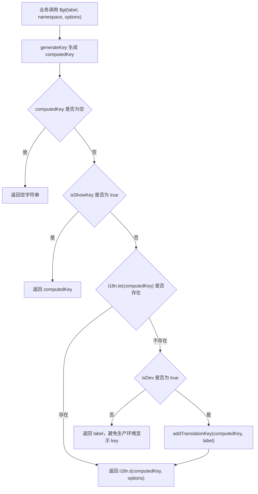

# Transify 翻译工具项目梳理

本文档梳理 `utils` 仓库中的 `transify` 翻译工具，以及它和完整 Transify 工具链的关系。当前仓库源码主要包含运行时翻译函数与开发态 key 收集能力；命令行扫描、上传、下载等能力在历史设计中属于配套包 `@scfe-common/utils-transify` 的 `ssc-tsf` CLI。

## 1. 项目定位

Transify 的目标是让业务代码直接写默认英文文案，由工具生成稳定翻译 key，并配合翻译平台完成 key 收集、上传、下载和运行时翻译。

典型使用方式：

```ts
import { generateTransifyVueI18n } from '@scfe-common/utils';

Vue.prototype.$gt = generateTransifyVueI18n(i18n, {
  isDev: process.env.NODE_ENV !== 'production',
  isShowKey: false,
  project: 'srm',
});
```

业务代码：

```ts
this.$gt('Order Id');
this.$gt('Hello {name}!', null, { name: 'Lay' });
this.$gt('Status', 'order');
```

## 2. 当前仓库代码结构

```text
src/
  index.ts
  transify/
    index.ts
    common.ts
    gt-vue.ts
    upload-tool.ts
```

各文件职责：

| 文件 | 职责 |
| --- | --- |
| `src/index.ts` | 包入口，导出 `transify` 模块。 |
| `src/transify/index.ts` | Transify 子模块入口，导出 `generateKey` 和 `generateTransifyVueI18n`。 |
| `src/transify/common.ts` | 公共类型、MD5 16 位 key 生成逻辑。 |
| `src/transify/gt-vue.ts` | 基于 vue-i18n 生成 `$gt` 翻译函数。 |
| `src/transify/upload-tool.ts` | 开发态 key 收集、清理、导出 JSON 的浏览器工具。 |

当前 npm 包构建由 `rollup.config.js` 负责，入口为 `src/index.ts`，产物包括 CJS、ESM、UMD 和类型声明。

## 3. 核心 API

### 3.1 `generateKey`

定义位置：`src/transify/common.ts`

用途：根据项目名、命名空间和默认文案生成稳定 key。

```ts
generateKey({
  label: 'Order Id',
  project: 'srm',
  namespace: 'order',
});
```

生成规则：

1. 将 `project`、`namespace`、`label` 按顺序用 `_` 拼接。
2. 过滤空值，所以 `namespace` 可为空。
3. 将空白字符替换为 `_`。
4. 对拼接结果做 MD5。
5. 取 MD5 结果的第 8 到第 24 位，得到 16 位 key。

伪代码：

```ts
const raw = [project, namespace, label].filter(Boolean).join('_').replace(/\s/g, '_');
const key = md5(raw).slice(8, 24);
```

注意：

- `project` 和 `label` 任一为空时返回空字符串。
- `namespace` 用于区分同一英文文案在不同上下文中的含义。
- `project` 必须和翻译平台/CLI 配置中的项目名保持一致，否则生成的 key 不一致。

### 3.2 `generateTransifyVueI18n`

定义位置：`src/transify/gt-vue.ts`

用途：把 vue-i18n 的 `t`、`te` 能力包装为项目统一翻译函数，一般挂到 `Vue.prototype.$gt`。

函数签名：

```ts
generateTransifyVueI18n(i18n, config): (label, namespace?, options?) => string
```

`config` 参数：

| 参数 | 类型 | 必填 | 说明 |
| --- | --- | --- | --- |
| `project` | `string` | 是 | 项目名，作为 key 生成前缀。 |
| `isDev` | `boolean` | 是 | 是否开发环境。开发环境会收集缺失 key。 |
| `isShowKey` | `boolean` | 否 | 是否直接显示生成后的 key，便于排查翻译映射。 |

返回的 `$gt` 参数：

| 参数 | 类型 | 必填 | 说明 |
| --- | --- | --- | --- |
| `label` | `string` | 是 | 默认文案，通常是英文。 |
| `namespace` | `string` | 否 | 命名空间，用于解决同文案不同语义。使用 `options` 时建议显式传 `null` 占位。 |
| `options` | `any` | 否 | 透传给 `i18n.t` 的插值参数。 |

## 4. 运行时翻译流程

`$gt(label, namespace, options)` 的执行流程如下：



关键行为：

- 生产环境中，如果 key 不存在，直接返回 `label`。
- 开发环境中，如果 key 不存在，会把 `key -> label` 收集到 `sessionStorage.collectKeys`。
- 最终仍调用 `i18n.t(computedKey, options)`。因此开发态缺失 key 时，页面实际展示取决于 vue-i18n 对缺失 key 的处理。
- `isShowKey` 打开后会短路翻译，直接显示生成后的 key。

## 5. 开发态 key 收集与导出

定义位置：`src/transify/upload-tool.ts`

### 5.1 暂存位置

收集到的 key 保存在浏览器 `sessionStorage`：

```text
collectKeys = {
  "16位md5key": "默认文案"
}
```

`sessionStorage` 的生命周期是当前浏览器 tab。刷新页面数据仍在，关闭 tab 后会丢失。

### 5.2 收集入口

`gt-vue.ts` 在开发环境遇到缺失 key 时调用：

```ts
addTranslationKey(computedKey, label);
```

`addTranslationKey` 行为：

1. 读取 `sessionStorage.collectKeys`。
2. 如果同一个 key 已存在但 value 不同，打印冲突错误并跳过更新。
3. 写入新的 `key -> label`。
4. 挂载控制台工具：
   - `window.translateToolExport`
   - `window.translateToolClear`

### 5.3 控制台工具

当前代码实际可用：

```js
translateToolExport();
translateToolClear();
```

说明：

| 方法 | 说明 |
| --- | --- |
| `translateToolExport()` | 将当前收集的 key 导出为 `dev.json`。 |
| `translateToolClear()` | 清空当前 tab 中的 `sessionStorage.collectKeys`。 |

当前源码注释中提到了 `translateToolCheck` 和 `translateToolUpload`，但实际挂载代码已被注释，不能直接使用。

建议采集流程：

1. 打开页面前先在控制台执行 `translateToolClear()`，避免历史数据混入。
2. 在开发环境中访问相关页面和交互路径，让 `$gt` 被执行。
3. 执行 `translateToolExport()` 导出 `dev.json`。
4. 将 `dev.json` 交给上传工具或翻译平台导入。

## 6. 上传能力现状

`src/transify/upload-tool.ts` 中保留了浏览器端一键上传实现草稿，包括：

- `postKeys({ keys, resourceURL, token })`
- `uploadTranslationKey(resourceURL, token)`
- 将 `resourceURL` 转换为平台 import API。
- 使用 `FormData` 上传 `dev.json`。

但这些代码目前整体被注释，且 `window.translateToolUpload` 没有挂载。因此在当前仓库源码中，浏览器端“一键上传”不是可用能力。

当前可用路径是导出 `dev.json`，再通过外部工具或翻译平台处理。

## 7. CLI 工具链关系

根据历史说明文档，完整 Transify 方案拆成两个包：

| 包 | 职责 |
| --- | --- |
| `@scfe-common/utils-transify-client` | 运行时 key 生成、`$gt` 翻译函数、show key 辅助插件等。 |
| `@scfe-common/utils-transify` | 本地 CLI 工具，命令名为 `ssc-tsf`，负责扫描、上传、下载、导出等。 |

当前 `utils` 仓库里的 `src/transify` 更接近 `utils-transify-client` 的运行时能力；仓库中的 `packages/transify`、`packages/transify-client` 目录目前只残留 `node_modules`，没有可维护源码。

历史 CLI 安装：

```bash
yarn add -D @scfe-common/utils-transify --registry https://npm.shopee.io
```

查看命令：

```bash
npx ssc-tsf -h
```

## 8. CLI 命令说明

以下为完整工具链中的 `ssc-tsf` 设计，不是当前 `src/transify` 源码直接提供的能力。

| 命令 | 作用 |
| --- | --- |
| `init` | 生成默认 `transify.config.js` 及代码示例。 |
| `update` | 扫描代码 diff 收录 key，并自动上传到翻译平台。 |
| `upload` | 批量上传指定 JSON 文件。 |
| `download` | 从翻译平台下载语言包到本地。 |
| `export` | 导出两个 commit/branch 之间新增 key 及配置语言的 CSV 文件。 |
| `scan` | 扫描指定文件或整个项目，收录 key 并上传。 |

常见用法：

```bash
npx ssc-tsf init
npx ssc-tsf update
npx ssc-tsf update --cached
npx ssc-tsf upload transify-key.json
npx ssc-tsf download --lang 1:en --path src/lang
npx ssc-tsf export release feature
npx ssc-tsf scan
npx ssc-tsf scan --file src
```

`init`、`update`、`upload`、`download` 等命令历史上支持 `--config` 指定配置文件：

```bash
npx ssc-tsf update --config transify.config.js
```

## 9. `transify.config.js` 配置

完整 CLI 工具链通常依赖 `transify.config.js`：

| 参数 | 类型 | 必填 | 说明 |
| --- | --- | --- | --- |
| `project` | `string` | 是 | 项目名，必须和 `$gt` 配置一致。 |
| `resourceId` | `number` | 是 | 翻译平台项目 ID。 |
| `token` | `string` | 是 | 翻译平台鉴权 token。 |
| `uploadUrl` | `string` | 是 | 翻译平台上传接口。 |
| `downloadUrl` | `string` | 是 | 翻译平台下载接口。 |
| `funName` | `string[]` | 是 | 需要扫描的函数名，例如 `['$gt']`。 |
| `fileType` | `string[]` | 是 | 扫描文件类型，例如 `['.js', '.vue', '.ts', '.tsx']`。 |
| `downloadDir` | `string` | 否 | 默认下载目录。 |
| `downloadLang` | `Record<string, string>` | 否 | 批量下载语言映射，例如 `{ 1: 'en-US' }`。 |
| `exportFileName` | `string` | 否 | 导出新增 key 文件名，可使用 Jira key。 |
| `scanFile` | `string` | 否 | `scan` 时限定扫描文件或目录。 |
| `isBackEnd` | `boolean` | 否 | 后端模式，历史版本用于错误码收集。 |
| `monorepoPath` | `string` | 否 | monorepo 子项目目录。 |

示例：

```js
module.exports = {
  project: 'srm',
  resourceId: 12345,
  token: 'Bearer xxx',
  uploadUrl: 'https://example.com/api/resources/123/import/json',
  downloadUrl: 'https://example.com/api/resources/123/download',
  funName: ['$gt'],
  fileType: ['.js', '.ts', '.tsx', '.vue'],
  downloadDir: 'src/lang',
  downloadLang: {
    1: 'en-US',
  },
};
```

## 10. 推荐工作流

### 10.1 当前仓库源码支持的轻量工作流

1. 接入 `generateTransifyVueI18n`，传入正确 `project`。
2. 业务代码统一使用 `$gt('Default text')`。
3. 开发环境访问页面，触发 `$gt`。
4. 控制台执行 `translateToolExport()` 导出 `dev.json`。
5. 将 `dev.json` 上传到翻译平台或交给外部 CLI。
6. 下载翻译平台语言包并接入 vue-i18n。

### 10.2 完整 CLI 工作流

1. 安装运行时包和 CLI 包。
2. 执行 `npx ssc-tsf init` 生成配置。
3. 接入 `$gt`。
4. 开发后执行 `git add . && npx ssc-tsf update --cached`。
5. 执行 `npx ssc-tsf download` 下载最新语言包。
6. 提交代码和语言包变更。

也可以放入 git hook 或 CI：

```json
{
  "gitHooks": {
    "pre-commit": "npx ssc-tsf update && npx ssc-tsf download --lang 1:en-US --path src/lang"
  }
}
```

## 11. 使用约束与最佳实践

### 11.1 `$gt` 必须传静态字符串

CLI 静态扫描依赖源码中的字面量，因此不要传变量、模板字符串或函数返回值。

不推荐：

```ts
this.$gt(label);
this.$gt(`COD Amount (${currency})`);
this.$gt(getLabel());
```

推荐：

```ts
this.$gt('Order Id');
this.$gt('COD Amount ({currency})', null, { currency });
```

### 11.2 使用 `options` 时保留第二个参数

第三个参数会透传给 `i18n.t`，第二个参数是 `namespace`。为了避免参数歧义，使用插值时建议写成：

```ts
$gt('Hello {name}!', null, { name: 'Lay' });
```

### 11.3 同文案不同含义使用 `namespace`

如果两个地方都是 `Status`，但语义不同：

```ts
$gt('Status', 'order');
$gt('Status', 'payment');
```

### 11.4 不要直接修改已有文案含义

key 由文案参与生成。修改默认文案会生成新 key；如果同一 key 对应不同 value，也会触发冲突。需要改语义时，建议明确使用新的文案或 namespace。

### 11.5 初始化时机

如果在 `$gt` 初始化前就计算静态配置，会导致拿不到正确翻译。可改为 getter 延迟计算：

```ts
const field = {
  name: 'trip_id',
  get label() {
    return $gt('Linehaul Trip ID');
  },
};
```

## 12. 已知问题和待补齐点

当前仓库源码与历史文档存在差异：

1. README 提到 `translateToolCheck` 和 `translateToolUpload`，但当前源码没有实际挂载。
2. 浏览器端上传逻辑存在于注释中，当前不可直接使用。
3. 当前仓库没有 `ssc-tsf` CLI 的可维护源码，CLI 能力需要依赖外部包 `@scfe-common/utils-transify`。
4. 当前 `generateTransifyVueI18n` 仅适配 vue-i18n；历史文档中的 `generateTransifyCommon`、`useSSCTransify` 不在当前源码中。
5. 测试用例目前只覆盖 `SAMPLE` 字符串，没有覆盖 key 生成、运行时 fallback、sessionStorage 收集和冲突处理。

建议后续补齐：

1. 为 `generateKey` 增加快照式单测，固定 key 生成规则。
2. 为 `generateTransifyVueI18n` 增加 dev/prod、isShowKey、te 缺失等分支测试。
3. 清理 README 中未启用的 `translateToolCheck`、`translateToolUpload` 描述，或恢复对应能力。
4. 明确当前包是否继续承载 Transify client，还是迁移到独立 `utils-transify-client`。
5. 如果需要一键上传，优先恢复 CLI 上传链路，避免浏览器端长期保存 token。

## 13. 一句话总结

当前 `utils` 仓库的 Transify 实现是一个运行时翻译 client：它负责按 `project + namespace + label` 生成 16 位 MD5 key，包装 vue-i18n 生成 `$gt`，并在开发环境自动收集缺失 key 到 `sessionStorage` 供导出。完整的静态扫描、上传、下载、导出和 monorepo 支持属于配套 `ssc-tsf` CLI 工具链，当前仓库源码中没有这部分实现。
